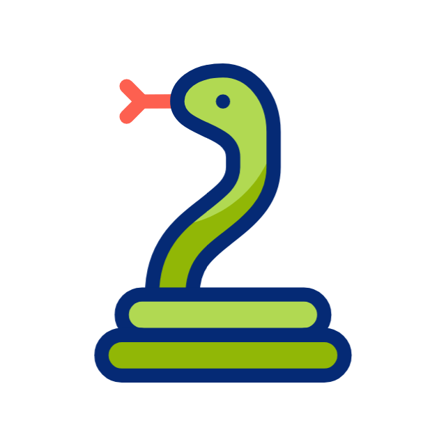

<h1 align="left">
  <span>Snake And Apple Game</span>
  
</h1>

A classic arcade-style game built with Python and the Pygame library. The objective is simple: control the snake, eat apples, and grow longer. Be careful not to hit the walls or yourself!

## ✨ Features

- **Classic Gameplay:** Simple and addictive snake game mechanics.
- **Score Tracking:** Keeps track of your score as you eat more apples.
- **Responsive Controls:** Intuitive controls using the arrow keys.
- **Game Over Screen:** Displays your final score when the game ends.
- **Sound Effects:** Includes background music and sound effects for eating and crashing.

## 🛠️ Technologies Used

| Technology | Purpose |
|------------|---------|
| Python | Core game logic |
| Pygame | Graphics, audio, and game loop |

## 📚 What I Learned

- Game loops and event handling
- Keyboard input management
- Collision detection
- Score tracking
- Working with images and sound effects in Pygame

## 📦 Prerequisites

To run this game, you will need the following installed:

- **Python 3.x**
- **Pygame library**

You can install Pygame using pip:

```bash
pip install pygame
```
You also need to ensure you have a folder named resources in the same directory as the main script, containing the necessary image and audio files.

## 🚀 How to Run

1. Clone this repository to your local machine:
   ```bash
   git clone https://github.com/Shruti788/Snake-game.git
   ```
2. Navigate to the project directory:
   ```bash
   cd Snake-game
   ```
3. Run the game:
   ```bash
   python snake_game.py
   ```

## 🎮 Controls

- **Up Arrow Key:** Move the snake up.
- **Down Arrow Key:** Move the snake down.
- **Left Arrow Key:** Move the snake left.
- **Right Arrow Key:** Move the snake right.
- **Enter Key:** Restart the game after "Game Over".
- **Escape Key:** Exit the game.

   
   
      


